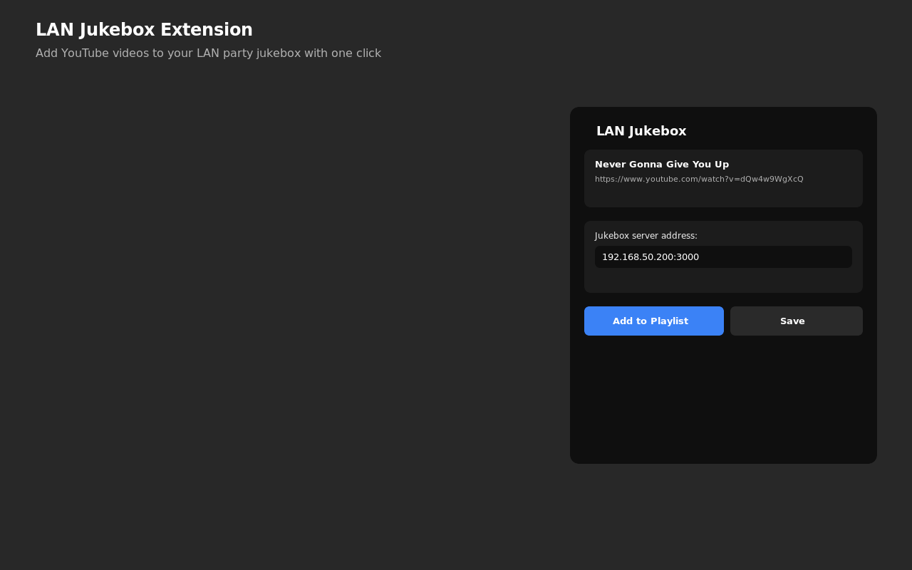
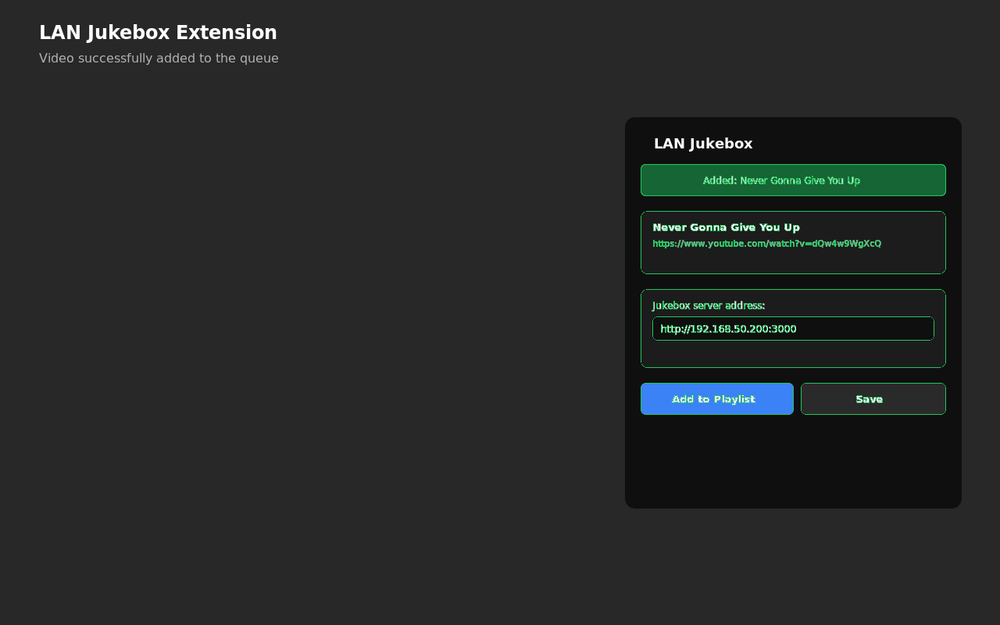
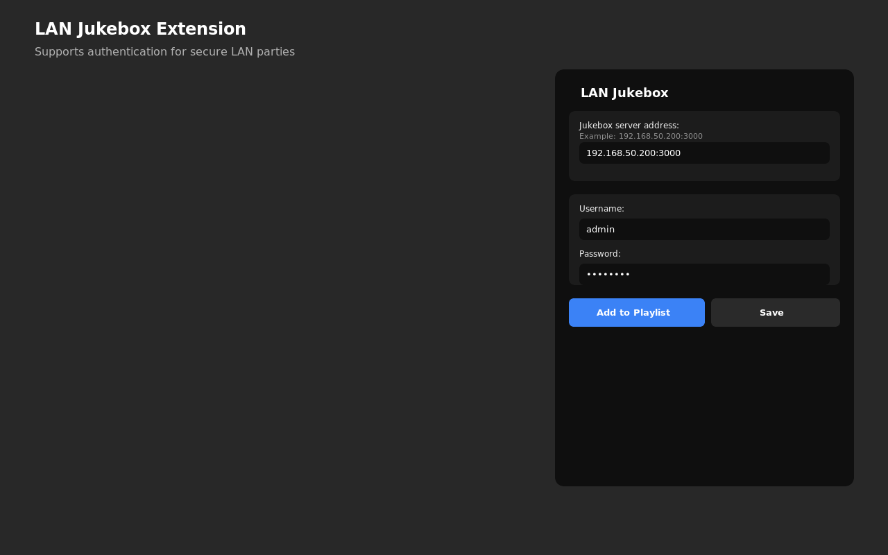

# LAN Jukebox - YouTube Adder Extension (Firefox)

Firefox extension for adding YouTube videos directly to your LAN Jukebox playlist.

## Screenshots

<p align="center">
  
  <br>
  <em>Main popup - Add videos with one click</em>
</p>

<p align="center">
  
  <br>
  <em>Success confirmation</em>
</p>

<p align="center">
  
  <br>
  <em>Optional authentication support</em>
</p>

## Features

- Add YouTube videos to the jukebox with one click
- **Keyboard shortcut: Alt+Shift+E** to quickly add videos
- Supports authentication (if jukebox requires login)
- Automatically saves server settings
- Shows video information before adding
- Works with Firefox 109+
- Automatic HTTP/HTTPS fallback

## Installation

### From Firefox Add-ons (Coming Soon)

Will be available on https://addons.mozilla.org

### Manual Installation (Development)

1. Open Firefox
2. Go to `about:debugging#/runtime/this-firefox`
3. Click **Load Temporary Add-on**
4. Select the `manifest.json` file from this directory
5. The extension is now loaded (temporary - will be removed when Firefox restarts)

### Permanent Manual Installation

1. Go to `about:config` in Firefox
2. Search for `xpinstall.signatures.required`
3. Set it to `false` (only in Developer/Nightly editions)
4. Package the extension as a ZIP file
5. Rename to `.xpi`
6. Drag and drop into Firefox

## Configuration

1. Open any YouTube video
2. Click the extension icon in the browser toolbar
3. Enter your LAN Jukebox server address, e.g., `192.168.50.200:3000` (http:// is added automatically)
4. If jukebox requires authentication, also enter username and password
5. Click **Save**

## Usage

### Method 1: Using the popup

1. Open a YouTube video you want to add to the jukebox
2. Click the extension icon
3. You'll see the video information in the popup window
4. Click **Add to Playlist**
5. The video is added to the jukebox queue!

### Method 2: Using keyboard shortcut

1. Open a YouTube video you want to add to the jukebox
2. Press **Alt+Shift+E**
3. A notification will appear confirming the video was added
4. The video is added to the jukebox queue!

## File Structure

```
lan-jukebox-extension-firefox/
├── manifest.json          # Extension manifest file (Firefox MV3)
├── popup.html            # Popup UI
├── popup.js              # Popup logic
├── background.js         # Background script (handles API calls and keyboard shortcuts)
├── content.js            # Content script (for future use)
├── icons/                # Extension icons
│   ├── icon16.png
│   ├── icon48.png
│   └── icon128.png
└── README.md             # This file
```

## Compatibility

- Firefox 109+
- Firefox Developer Edition
- Firefox Nightly

## Troubleshooting

### "Connection error" message

- Check that the LAN Jukebox server is running
- Verify the server address is correct
- Make sure the server is accessible on the network
- The extension will automatically try HTTPS if HTTP fails

### "Login failed" message

- Check your username and password
- Verify that `requireLogin: true` is set in the jukebox server's `config.json`

### Extension doesn't appear in browser toolbar

- Click the extensions icon (puzzle piece) and pin "LAN Jukebox" to the toolbar

## Firefox Add-ons Publishing

Ready to publish to Firefox Add-ons! See [FIREFOX_ADDONS_GUIDE.md](FIREFOX_ADDONS_GUIDE.md) for complete instructions.

## Distribution

### For End Users
Download the `.xpi` file when available from Firefox Add-ons.

### For Developers
See publishing guide for submission instructions.

## Privacy

This extension does NOT collect any user data. All settings are stored locally on your device. See [PRIVACY_POLICY.md](PRIVACY_POLICY.md) for details.

## Related Projects

- [LAN Jukebox Server](https://github.com/maribotto/lan-jukebox) - The server component
- [Chrome Extension](https://github.com/maribotto/lan-jukebox-extension-chrome) - Chrome/Brave version

## License

ISC

## Author

Created for LAN parties!
